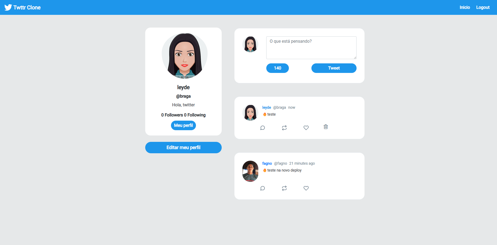

# Twitter Clone

<h1 align="center"> Twitter Clone </h1>

## 🚀 Tecnologias

Esse projeto foi desenvolvido com as seguintes tecnologias:

- **Python 3.x**:
- **Django**:
- **PostgreSQL**:
- **Docker**:
- **Git e GitHub**:

## 💻 Projeto

Este é um clone do Twitter desenvolvido com Django. O projeto inclui as seguintes funcionalidades:

- Registro e autenticação de usuários.
- Postagens e feed de atualizações.
- Interface administrativa para gerenciamento de usuários e postagens.



- [Acesse o projeto online](https://clone-twitter.fly.dev/)
- [Meu portfólio](https://www.gleidsonfagno.com.br/)

## 📋 Como Utilizar

Para configurar e executar o projeto localmente, siga estas etapas:

1. **Clone o repositório ou faça o download como ZIP:**

   ```bash
   git clone https://github.com/gleidsonfagno/twitter-clone.git
